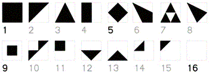

# Identicon :cloud: :sparkles: :construction_worker:

[Identicon](https://en.wikipedia.org/wiki/Identicon) service built as a JavaScript [Cloudflare Worker](https://workers.cloudflare.com/). Algorithm implementation inspired by [the original Java code by Don Park](https://web.archive.org/web/20080703155749/http://www.docuverse.com/blog/donpark/2007/01/19/identicon-updated-and-source-released).

[Demo](https://identicon.mauricius.workers.dev/6b3eb288cd0ac76efa64097b38a81cb6e23ae031)

## About Cloudflare Workers

> Cloudflare Workers provides a serverless execution environment that allows you to create entirely new applications or augment existing ones without configuring or maintaining infrastructure.

[Documentation](https://workers.cloudflare.com/docs)

### Instructions

- `npm install`
- `npm run build`

To open the Workers preview with the built Worker:

- `npm run preview`

or you can use [Wrangler](https://github.com/cloudflare/wrangler)

- `wrangler build`
- `wrangler preview`

## About the Identicon Algorithm

An Identicon is a visual representation of a hash value, usually derived from an IP address. The input of this algorithm is a `SHA-1` string, from which the first 4 bytes (32 bits) are extracted to serve as source for the Identicon.

`11111111 11111111 11111111 11111111`

The generated Identicon is a **3x3** grid, built using only 3 types of patches, out of [16 available](#patches), in 9 positions.

- one patch for the center position
- one patch for the 4 **S**ides
- one patch for the 4 **C**orners

```
┌──┬──┬──┐
│C │S │ C│
├──┼──┼──┤
│S │  │ S│
├──┼──┼──┤
│C │ S│ C│
└──┴──┴──┘
```

### Positions and Rotations

For center position, only a symmetric patch is selected (out of 4 available). For corner and side positions, patch is rotated by 90° moving clock-wise starting from top-left position and top position respectively. This means 2 bits out of identicon code are used to select the center patch, 4 bits each for corner and side patches, 2 bits each for starting rotation of corner and side patches.

### Coloring and Inverting

The background is always white. The patch color is selected using 15 bits from the identicon code, expending 5 bits for each color component (Red, Green, Blue) placed at high-end of the component value (bits << 3). 1 bit per patch is used for inversion, meaning selected color will be used as background and white used as the patch shape color.

Adding it up, we are using 32 bits (actually 31, more on that later) to render an identicon.

| 11111 | 11111 | 11111 |   11   |   1    | 1111  |   11   |   1    |  1111  |   1    |   11   |
| :---: | :---: | :---: | :----: | :----: | :---: | :----: | :----: | :----: | :----: | :----: |
|  red  | green | blue  |  side  |  side  | side  | corner | corner | corner | middle | middle |
| color | color | color | rotate | invert | shape | rotate | invert | shape  | invert | shape  |

### Potential Combinations

#### Center

- `2² = 4` pattern choices
- `2¹ = 2` color choices (inverted or not)

#### Edges

- `2⁴ = 16` pattern choices
- `2¹ = 2` color choices (inverted or not)
- `2² = 4` pattern rotation choices (some may be identical)

  - `0` - no rotation
  - `1` - 90° rotation
  - `2` - 180° rotation
  - `3` - 270° rotation

#### Corners

- `2⁴ = 16` pattern choices
- `2¹ = 2` color choices (inverted or not)
- `2² = 4` pattern rotation choices (some may be identical)

#### Colors

- `2⁵ = 32` choices for red color
- `2⁵ = 32` choices for green color
- `2⁵ = 32` choices for blue color

### Patches



There are 16 potential patterns to use to create the identicon. Using a **5x5** grid like the following

```
┌──┬──┬──┬──┬──┐
│ 0│ 1│ 2│ 3│ 4│
├──┼──┼──┤──┤──┤
│ 5│ 6│ 7│ 8│ 9│
├──┼──┼──┼──┼──┤
│10│11│12│13│14│
├──┼──┼──┼──┼──┤
│15│16│17│18│19│
├──┼──┼──┼──┼──┤
│20│21│22│23│24│
└──┴──┴──┴──┴──┘
```

we can define each pattern using an array to stores the vertices.

```
const shape1 = [0, 4, 24, 20];
┌ ─ ─ ─ ┐
│       │
│       │
│       │
└ ─ ─ ─ ┘
```

```
const shape2 = [0, 4, 20];
┌ ─ ─ ─ ─
│      ╱
│    ╱
│  ╱
|╱
```

```
const shape3  = [2, 24, 20];
   ╱╲
  ╱  ╲
 ╱    ╲
╱______╲
```

```
const shape4  = [0, 2, 20, 22];
_____
╲   ╱
 ╲ ╱
 ╱ ╲
╱___╲
```

```
const shape5  = [2, 14, 22, 10];

  / \
 /   \
 \   /
  \ /
```

```
const shape6  = [0, 14, 24, 22];
\
\ \
 \  \
  \   \
   ───┘
```

```
const shape7  = [2, 24, 22, 13, 11, 22, 20];
   /\
  /__\
 ╱\  /\
╱__\/__\
```

```
const shape8  = [0, 14, 22];
 \
\  \
 \   \
  \  /
   \/
```

```
const shape9  = [6, 8, 18, 16];

  ┌ ─ ┐
  │   │
  └ ─ ┘

```

```
const shape10  = [4, 20, 10, 12, 2];
     ___
    |  ╱
 ___|╱
│  ╱
|╱
```

```
const shape11 = [0, 2, 12, 10];
┌ ─ ┐
│   │
└ ─ ┘


```

```
const shape12 = [10, 14, 22];

______
\    /
 \  /
  \/
```

```
const shape13 = [20, 12, 24];


  /\
 /  \
/____\
```

```
const shape14 = [10, 2, 12];
  /|
/__|


```

```
const shape15 = [0, 2, 10];
 ___
|  ╱
|╱


```

Note that the 16th shape is just an inverted version of the first one.

## Example

Let's try to recreate the Identicon of my GitHub username:

<p style="text-align: center">
  
</p>

Before starting we need to remember two important notions:

- The maximum number in 32-bits space is `parseInt("1111111111111111111111111111111", 2) = 2147483647` (or `2³¹ - 1`, since the first bit is the sign bit).
- Numbers in JavaScript are represented by 64-bit values, but bitwise operators always return a 32-bit integer.

### Hash the input

`'mauricius'` after the SHA-1 hashing process becomes `6b3eb288cd0ac76efa64097b38a81cb6e23ae031`. We take the first 4 bytes and convert the value to an integer. In this case it is `1799271048`.

`1799271048` in binary is `1101011001111101011001010001000`.

### Center Patch

#### Take the shape

The last two bits define the shape in the center (4 available options)

```
1101011001111101011001010001000 &
0000000000000000000000000000011
---------------------------------
0000000000000000000000000000000
```

We need to take the shape of index 0, which is the square.

#### Invert

We right-shift the binary representation of `1799271048` of two positions:

```
1101011001111101011001010001000 >> 2
0011010110011111010110010100010
```

or `449817762` in decimal. We take the last bit

```
11010110011111010110010100010 &
00000000000000000000000000001
-------------------------------
00000000000000000000000000000
```

Since `0` is `false` we do not invert the colors of the center shape. This is the result

<p style="text-align: center">
  
</p>

### Corner patches

#### Take the shape

Again, we need to right-shift the binary representation of `1799271048` of 3 positions:

```
1101011001111101011001010001000 >> 3
0001101011001111101011001010001
```

or `224908881` in decimal. We take the last 4 bits:

```
0001101011001111101011001010001 &
0000000000000000000000000001111
---------------------------------
0000000000000000000000000000001
```

Since `2⁰ = 1`, we take the shape 2 which has index 1.

#### Invert

We shift the binary representation of `1799271048` of 7 positions:

```
1101011001111101011001010001000 >> 7
0000000110101100111110101100101
```

or `14056805` in decimal. We take the last bit:

```
0000000110101100111110101100101 &
0000000000000000000000000000001
---------------------------------
0000000000000000000000000000001
```

Since `1` is `true` we invert the colors of the corner shape.

#### Rotate

We shift the binary representation of `1799271048` of 8 positions:

```
1101011001111101011001010001000 >> 8
0000000011010110011111010110010
```

or `7028402` in decimal. We take the last 3 bits:

```
0000000011010110011111010110010 &
0000000000000000000000000000111
---------------------------------
0000000000000000000000000000010
```

Since `2¹ = 2`, we start with the patch rotated by 180° in the upper-left corner and we keep rotating for every corner.

<p style="text-align: center">
  
</p>

### Edge patches

#### Take the shape

We need to shift the binary representation of `1799271048` of 10 positions:

```
1101011001111101011001010001000 >> 10
0000000000110101100111110101100
```

or `1757100` in decimal. We take the last 4 bits:

```
0000000000110101100111110101100 &
0000000000000000000000000001111
---------------------------------
0000000000000000000000000001100
```

Since `2³ + 2² = 12`, we take the shape 13 which has index 12.

#### Invert

We shift the binary representation of `1799271048` of 14 positions:

```
1101011001111101011001010001000 >> 14
0000000000000011010110011111010
```

or `109818` in decimal. We take the last bit:

```
0000000000000011010110011111010 &
0000000000000000000000000000001
---------------------------------
0000000000000000000000000000000
```

Since `0` is `false` we do not invert the colors of the edge shapes.

#### Rotate

We shift the binary representation of `1799271048` of 15 positions:

```
1101011001111101011001010001000 >> 15
0000000000000001101011001111101
```

or `54909` in decimal. We take the last 2 bits:

```
0000000000000001101011001111101 &
0000000000000000000000000000011
---------------------------------
0000000000000000000000000000001
```

Since `2⁰ = 1` we start with the patch rotated by 90° in the top edge and we keep rotating it for every edge.

<p style="text-align: center">
  
</p>

### Colors

#### :blue_heart: Blue

We shift the binary representation of `1799271048` of 17 positions:

```
1101011001111101011001010001000 >> 17
0000000000000000011010110011111
```

or `13727` in decimal. We take the last 5 bits:

```
0000000000000000011010110011111 &
0000000000000000000000000011111
---------------------------------
0000000000000000000000000011111
```

and we left shift this last value in order to get a number in the 0-255 range.

```
0000000000000000000000000011111 << 3
0000000000000000000000011111000
```

or `248` in decimal.

Since using [left-shifting](<https://developer.mozilla.org/en-US/docs/Web/JavaScript/Reference/Operators/Bitwise_Operators#%3C%3C_(Left_shift)>) means that zero bits are shifted in from the right, the maximum value that we can obtain in the 0-255 range is exactly `248`. This isn't valid for the [Red color](#red), as we will see later.

#### :green_heart: Green

We shift the binary representation of `1799271048` of 22 positions:

```
1101011001111101011001010001000 >> 22
0000000000000000000000110101100
```

or `428` in decimal. We take the last 5 bits:

```
0000000000000000000000110101100 &
0000000000000000000000000011111
---------------------------------
0000000000000000000000000001100
```

and we left shift this last value in order to get a number in the 0-255 range.

```
0000000000000000000000000001100 << 3
0000000000000000000000001100000
```

or `96` in decimal.

#### :heart: Red

We have only 4 bits left for the red color. Since we are using the [sign-propagating right shift operator](<https://developer.mozilla.org/en-US/docs/Web/JavaScript/Reference/Operators/Bitwise_Operators#%3E%3E_(Sign-propagating_right_shift)>), we will always use the sign bit (which is `0` because we are using positive values) to build the red color.

We right-shift the binary representation of `1799271048` of 27 positions:

```
1101011001111101011001010001000 >> 27
0000000000000000000000000001101
```

or `13` in decimal. We take the last 5 bits:

```
0000000000000000000000000001101 &
0000000000000000000000000011111
---------------------------------
0000000000000000000000000001101
```

and we left shift this last value in order to get a number in the 0-255 range.

```
0000000000000000000000000001101 << 3
0000000000000000000000001101000
```

or `104` in decimal.

The maximum red value that we can obtain in the 0-255 range is `120`. This means that the identicon will always be colored towards the Blue channel.

The foreground color will then be `rgb(104,96,248)`.

<p style="text-align: center">
  
</p>

## License

[MIT](LICENSE)
